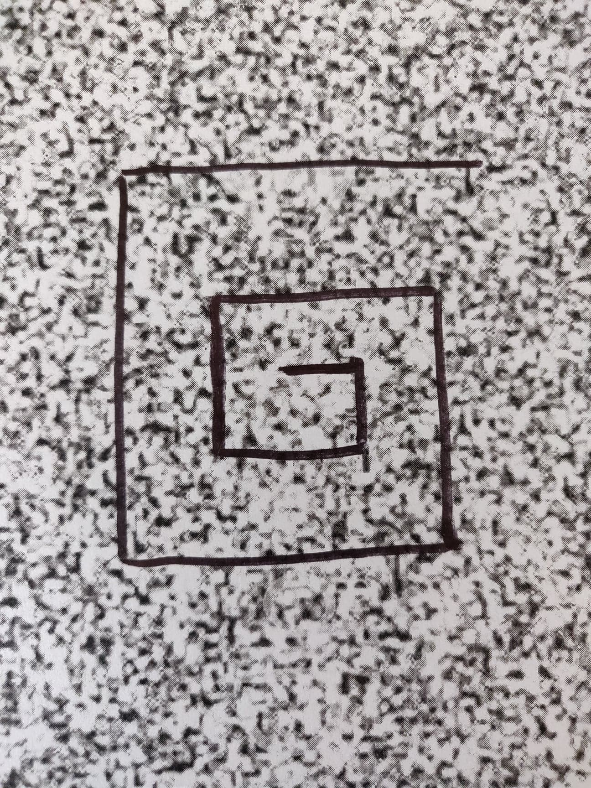
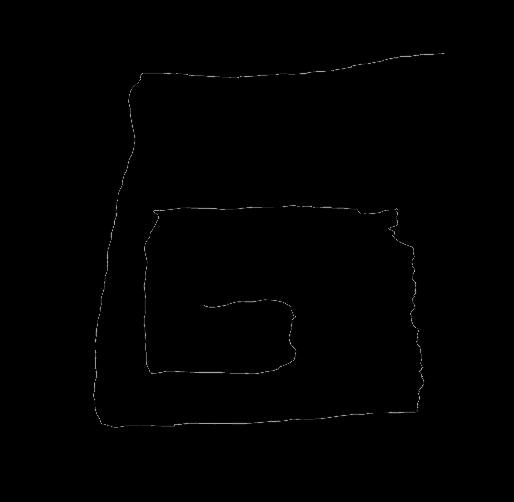

# opticalflow-opencv-cpp
Uses optical flow analysis to convert video into motion paths. Images are generated by two
different optical flow algorithms, farneback (dense) and lucas kanade (sparse).

Images can be found
under the flowimages folder and are separated by the fps (240 and 60) of their respective videos.

Keep in mind that these images are very large in order to accomodate the full motion path, and thus
will need to be downloaded for optimal viewing.

Sample trace path and corresponding result:

# Resources
Here are the [videos used for analysis](https://drive.google.com/open?id=1tGOOCLuhptdMx-McrgoeJ6zHkUeBpKsj)

Xcode was used to develop with OpenCV. [Here's](https://www.youtube.com/watch?v=o62iO8SssZk) a helpful video detailing how to set this up.

It is also advised to check out the [OpenCV official website](https://opencv.org) and the [docs](https://docs.opencv.org/3.0-beta/).

